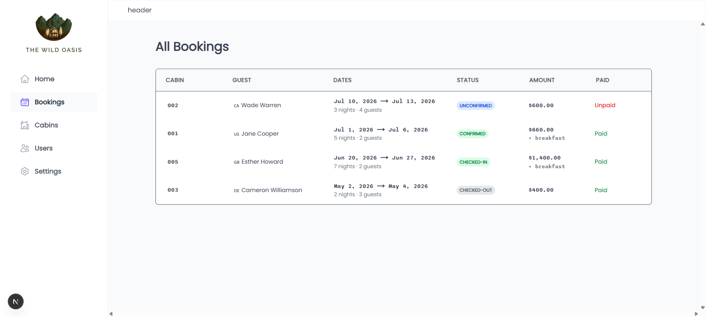

# The Wild Oasis — Hotel Management

A staff-facing booking-management app for a boutique cabin hotel: manage cabins,
guests, bookings, and hotel settings. Built as a portfolio piece to demonstrate
a clean, layered architecture on a modern Next.js stack.

> Showcase project — designed to be read and run locally, not deployed. It ships
> with a seeded SQLite database so you can `clone → install → seed → dev`.



## Tech stack

- **Next.js 16** (App Router, Server Components & Server Actions) + **React 19**
- **TypeScript** (strict)
- **Prisma 7** with the **better-sqlite3 driver adapter** (local SQLite)
- **Zod 4** for validation, shared across client and server
- **react-hook-form** for forms
- **Tailwind CSS 4** (+ some hand-written CSS) for styling
- **Jest** + Testing Library for unit tests

## Getting started

```bash
pnpm install      # installs deps and generates the Prisma client (postinstall)
pnpm seed         # resets + seeds the local SQLite database with demo data
pnpm dev          # http://localhost:3000  (redirects to /dashboard)
```

The repo includes a pre-seeded `prisma/dev.db`, so `pnpm dev` works without
seeding; run `pnpm seed` any time to reset to a known demo dataset.

### Scripts

| Command | Description |
|---|---|
| `pnpm dev` | Start the dev server (Turbopack) |
| `pnpm build` | Production build |
| `pnpm seed` | Reset and seed the database |
| `pnpm test` | Run the unit test suite |
| `pnpm lint` | Lint `src` and `__tests__` |

## Architecture

The codebase follows an industry-standard `src/` layout with a clear,
one-direction dependency flow. UI talks to **server actions**, which call
**services** (business logic), which call **data access** (Prisma). The core
business logic stays free of framework concerns.

```
src/
  app/                 # routes only — pages, layouts, route groups
    (dashboard)/       # authenticated-area shell (sidebar + header)
  components/
    ui/                # reusable primitives (Table, Modal, Sort, Filter, …)
    cabins/  bookings/  settings/   # feature components
  hooks/               # shared client hooks (useClickOutside, …)
  lib/
    prisma.ts          # single PrismaClient (driver adapter)
    utils.ts           # pure helpers (formatCurrency, formatDate)
    validations/       # Zod schemas — the source of truth for shapes
  server/
    actions/           # "use server" entry points the UI calls
    services/          # business logic / DTO mapping
    data/              # Prisma queries (the only place that touches the DB)
  types/               # cross-cutting types (ApplicationError, result types)
__tests__/             # unit tests, mirroring src/
```

**Why this shape**

- **Separation of concerns / testability** — `services` and `data` are plain
  functions with no React or Next imports, so they're unit-tested with Prisma
  mocked, no browser or server required.
- **One source of truth for validation** — Zod schemas in `lib/validations` are
  used by react-hook-form on the client *and* re-parsed in server actions, so
  bad input can't slip past the client.
- **Swappable persistence** — all DB access is isolated in `server/data` behind
  Prisma, so the store could change without touching business logic or UI.
- **Typed error handling** — operations return a discriminated result
  (`{ success, appError }`) via a shared `ApplicationError`, instead of throwing
  across layers.

## Data model

`Bookings` belongs to a `Cabin` and a `Guests` via foreign keys; a cabin and a
guest each have many bookings. `Settings` holds hotel-wide configuration.

## Testing

```bash
pnpm test
```

Unit tests cover the Zod schemas (validation rules), utility formatters, the
typed error layer, and the data/service logic (Prisma mocked) — including the
duplicate-name guard, delete guards, filter building, and DTO mapping.
