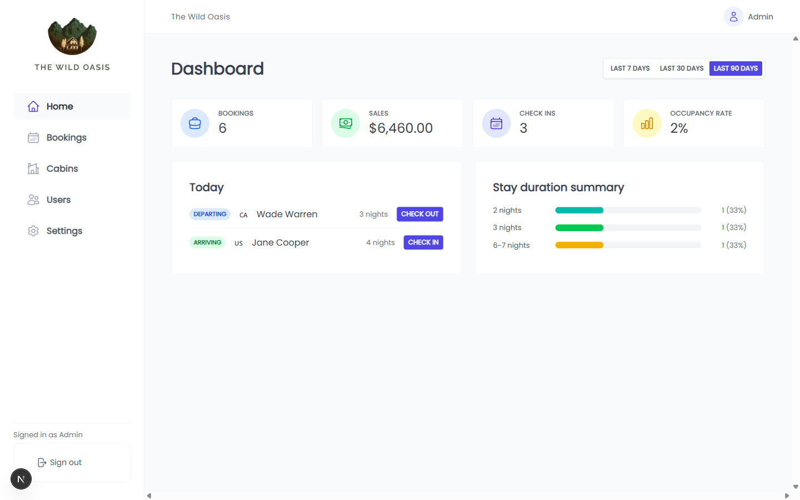

# The Wild Oasis — Hotel Management

A staff-facing booking-management app for a boutique cabin hotel: an at-a-glance
dashboard plus management of cabins, bookings, staff users, and hotel settings.
Built as a portfolio piece to demonstrate a clean, layered architecture on a
modern Next.js stack.

> Showcase project — designed to be read and run locally, not deployed. It ships
> with a seeded SQLite database so you can `clone → install → seed → dev`.



## Features

- **Dashboard** — a 7/30/90-day filter drives four live stats (bookings, sales,
  check-ins, occupancy rate), a "Today" feed with one-click check-in / check-out,
  and a stay-duration breakdown.
- **Bookings** — sortable table with inline edit (modal) and cancel; a booking
  form with a cabin-availability calendar and guest picker.
- **Cabins** — sortable table with create, edit, duplicate, delete, and a
  per-cabin availability view.
- **Users** — create staff logins and review existing accounts.
- **Settings** — hotel-wide booking limits and breakfast price.


## Tech stack

- **Next.js 16** (App Router, Server Components & Server Actions) + **React 19**
- **TypeScript** (strict)
- **Prisma 7** with the **better-sqlite3 driver adapter** (local SQLite)
- **Zod 4** for validation, shared across client and server
- **react-hook-form** for forms
- **Tailwind CSS 4** (+ some hand-written CSS) for styling
- **Jest** + Testing Library for unit tests

## Getting started

```bash
pnpm install      # installs deps and generates the Prisma client (postinstall)
pnpm seed         # resets + seeds the local SQLite database with demo data
pnpm dev          # http://localhost:3000  (redirects to /dashboard)
```

The repo includes a pre-seeded `prisma/dev.db`, so `pnpm dev` works without
seeding; run `pnpm seed` any time to reset to a known demo dataset.

**Sign in with the demo account:** `admin@thewildoasis.com` / `password123`
(also shown on the login screen). The whole dashboard is gated behind auth.

### Scripts

| Command | Description |
|---|---|
| `pnpm dev` | Start the dev server (Turbopack) |
| `pnpm build` | Production build |
| `pnpm seed` | Reset and seed the database |
| `pnpm test` | Run the unit test suite |
| `pnpm lint` | Lint `src` and `__tests__` |

## Architecture

The codebase follows an industry-standard `src/` layout with a clear,
one-direction dependency flow. UI talks to **server actions**, which call
**services** (business logic), which call **data access** (Prisma). The core
business logic stays free of framework concerns.

```
src/
  app/                 # routes only — pages, layouts, route groups
    (dashboard)/       # authenticated-area shell (sidebar + header)
  components/
    ui/                # reusable primitives (Button, Table, Modal, Sort, Tag, …)
    dashboard/ bookings/ cabins/ users/ settings/   # feature components
  hooks/               # shared client hooks (useClickOutside, …)
  lib/
    prisma.ts          # single PrismaClient (driver adapter)
    utils.ts           # pure helpers (formatCurrency, formatDate)
    validations/       # Zod schemas — the source of truth for shapes
  server/
    actions/           # "use server" entry points the UI calls
    services/          # business logic / DTO mapping
    data/              # Prisma queries (the only place that touches the DB)
  types/               # cross-cutting types (ApplicationError, result types)
__tests__/             # unit tests, mirroring src/
```

**Why this shape**

- **Separation of concerns / testability** — `services` and `data` are plain
  functions with no React or Next imports, so they're unit-tested with Prisma
  mocked, no browser or server required.
- **One source of truth for validation** — Zod schemas in `lib/validations` are
  used by react-hook-form on the client *and* re-parsed in server actions, so
  bad input can't slip past the client.
- **Swappable persistence** — all DB access is isolated in `server/data` behind
  Prisma, so the store could change without touching business logic or UI.
- **Typed error handling** — operations return a discriminated result
  (`{ success, appError }`) via a shared `ApplicationError`, instead of throwing
  across layers.
- **Streaming UI** — data-driven pages render the shell + heading instantly and
  stream their table/form in via React `<Suspense>` boundaries with skeleton
  fallbacks (see `src/app/(dashboard)/*/page.tsx` + `components/ui/Skeleton`).
- **Dynamic metadata** — pages derive their `<title>`/description from live data
  via `generateMetadata` (e.g. "Cabins (6)"), composed through a root title
  template; the data fetch is shared with the page render via React `cache()`.
- **Error boundaries** — a dashboard `error.tsx` catches page errors and offers
  a "Try again" recovery inside the app shell, with a `global-error.tsx`
  last-resort boundary for root-level failures.
- **Authentication** — credentials login with hashed passwords (scrypt), a
  signed **JWT session cookie** (`jose`, httpOnly), and **middleware** that
  gates the whole dashboard and redirects to `/login`.

## Data model

`Bookings` belongs to a `Cabin` and a `Guests` via foreign keys (and carries a
`createdAt` that feeds the dashboard's recent-activity stats); a cabin and a
guest each have many bookings. `Settings` holds hotel-wide configuration, and
`User` backs staff authentication.

## Testing

```bash
pnpm test
```

Unit tests cover the Zod schemas (validation rules), utility formatters, the
typed error layer, and the data/service logic (Prisma mocked) — including the
duplicate-name guard, delete guards, filter building, and DTO mapping.
